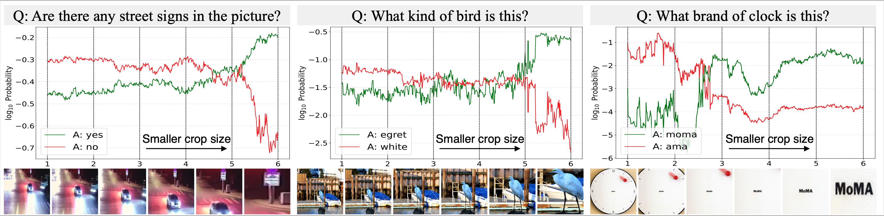
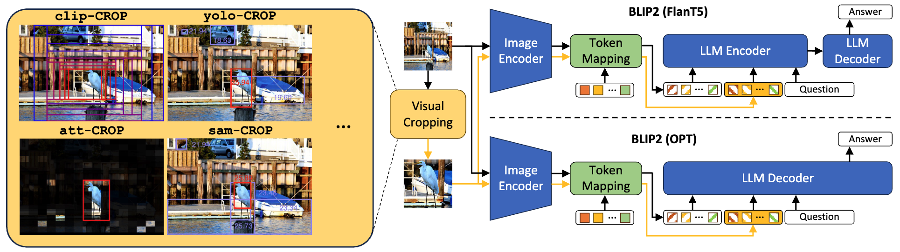
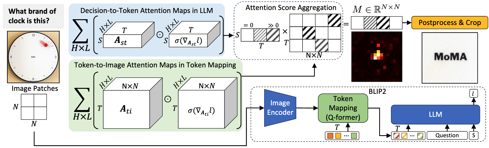

# ViCrop: Perceiving Small Visual Details in Zero-shot Visual Question Answering with Multimodal Large Language Models

[Jiarui Zhang](https://saccharomycetes.github.io/), [Mahyar Khayatkhoei](https://mahyarkoy.github.io/), [Prateek Chhikara](https://www.prateekchhikara.com/), [Filip Ilievski](https://www.ilievski.info/)

[[`Paper`]](https://arxiv.org/abs/2310.16033)


## Introduction

In this work, we investigate whether multimodal LLMs can perceive small details as well as large details in images. We show that their zero-shot accuracy in answering visual questions is very sensitive to the size of the visual subject of the question. In particular, BLIP2's zero-shot accuracy on the smaller text seubset of TextVQA is $45.91$\% lower than its accuracy on the larger text subset. Furthermore, we show that this effect is causal by observing that human visual cropping can significantly mitigate their sensitivity to size. To scale up the usefulness of human cropping, we propose **ViCrop**, a general framework that utilizes automatic visual cropping to enhance zero-shot VQA of MLLMs. We construct five variants of **ViCrop** leveraging either external localization models or the decision process of the given MLLM itself. Our results show that **ViCrop** improves MLLMs' zero-shot accuracy across different VQA datasets, for example, enhances BLIP2-T5's performance by $32.23$\% on the TextVQA test set.

Three quatitative observations with BLIP2-FlanT5-XL are shown below(the picture is clear, you may need to zoom in, like what we did in **ViCrop**😆). The model gradually corrects itself on **object existence**, **category detection**, and **text reading** when zooming in.



The proposed **ViCrop** framework is illstrated below. We propose five variants of **ViCrop** leveraging either external localization models or native cropping where we utilize the MLLM’s inference time dynamics, i.e., gradients and attention.



Illstration of attention-based cropping:



Next, we provide notebook examples for **ViCrop**. We encourage to test the pipeline on different datasets and models!


## Testing Cropping Methods and See How Cropping helps BLIP2 Answer Question Better

(optional) Create a conda environment and activate it.

```
conda create -n vicrop python=3.8
conda activate vicrop
```

Clone the repoisitory

```
git clone https://github.com/saccharomycetes/vicrop.git
cd vicrop
```

Since we have made a modification to the original [LAVIS](https://github.com/salesforce/LAVIS) library, please use the following command to install the modified LAVIS library.

```
cd LAVIS
pip install -e .
```

Then install the rest of the dependencies.

```
cd ..
pip install -r requirements.txt
``````

Download the model checkpoints

SAM model checkpoint [here](https://dl.fbaipublicfiles.com/segment_anything/sam_vit_h_4b8939.pth)

YOLO model checkpoint [here](https://github.com/ultralytics/assets/releases/download/v0.0.0/yolov8x.pt)

Or you can download them using the following command

```
wget https://dl.fbaipublicfiles.com/segment_anything/sam_vit_h_4b8939.pth
wget https://github.com/ultralytics/assets/releases/download/v0.0.0/yolov8x.pt
```

Now you will be ready to run the `external_crop.ipynb` and `native_crop.ipynb` to see how cropping helps BLIP2 answer question better.

You can also adapt the code to your own dataset by following the notebook.

## Citation

If you find our research to be useful or insightful, please consider citing the following paper:

```bibtex
@article{zhang2023visual,
  title={Visual Cropping Improves Zero-Shot Question Answering of Multimodal Large Language Models},
  author={Zhang, Jiarui and Khayatkhoei, Mahyar and Chhikara, Prateek and Ilievski, Filip},
  journal={arXiv preprint arXiv:2310.16033},
  year={2023}
}
```

## Contact

-   `jzhang37@usc.edu`